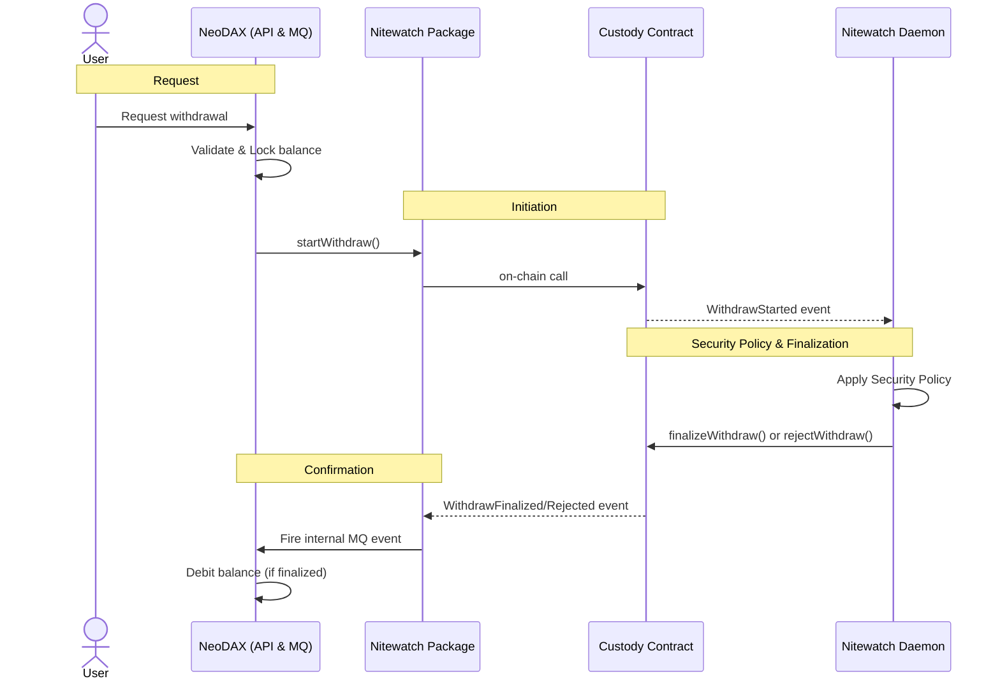

# Nitewatch

Nitewatch is a package used by **NeoDAX** to interact with an EVM on-chain custody contract through the `ICustody` interface. It provides the security policy engine and the infrastructure to manage deposits and withdrawals.

NeoDAX utilizes the Nitewatch package to run two primary processes:

1. **Event Daemon**: Produces `ICustody` events by listening to the blockchain and pushing them to an internal Message Queue (MQ).
2. **Contract Interface**: An implementation to call smart-contract methods (e.g., starting or finalizing withdrawals).

## Stack

- **Smart Contracts**: Solidity (Forge)
- **Backend**: Go
- **Blockchain**: EVM-compatible chains

## Features

### Deposits

1. User deposits native ETH or ERC20 tokens into the custody contract via a frontend dApp.
2. The **Event Daemon** detects the on-chain event.
3. An internal event is fired to the NeoDAX MQ.
4. NeoDAX credits the user's balance.

### Withdrawals

Withdrawals are governed by a security policy engine that tracks per-user and global limits (hourly/daily).

1. User requests a withdrawal via the NeoDAX Web API.
2. NeoDAX validates the request internally and locks the user's balance.
3. NeoDAX uses the Nitewatch package to call `startWithdraw` on the custody contract.
4. The **Nitewatch Daemon** listens for the `WithdrawStarted` event, applies the security policy, and then either calls `finalizeWithdraw` or `rejectWithdraw`.
5. The **Event Daemon** waits for the outcome (`WithdrawFinalized` with `success` being either `true` or `false`), fires an internal event, and NeoDAX debits the balance upon successful confirmation.

## Flows

### Withdrawal Flow



## Deployments

| Network | Contract | Address |
|---------|----------|---------|
| Ethereum Mainnet | ThresholdCustody | [`0x3a9624f9bb2dc43e90c0699ddc4a9b6bec147cde`](https://etherscan.io/address/0x3a9624f9bb2dc43e90c0699ddc4a9b6bec147cde#code) |

**Contract details:**
- Solidity `0.8.30` (Prague EVM)
- Compiler optimization: 1,000,000 runs
- License: MIT

## Usage

### Building from source

```bash
go build -ldflags "-X github.com/layer-3/nitewatch.Version=v1.0.0" -o nitewatch ./cmd/nitewatch
```

### Running the daemon

```bash
nitewatch worker
```

The daemon starts the security policy engine, event listeners, and the health endpoint. Configuration is loaded from environment variables or a YAML file (see [Configuration](#configuration)).

### CLI reference

The `nitewatch` binary doubles as an operations CLI for deploying contracts, submitting transactions, querying on-chain state, and inspecting the local database.

#### Service

| Command | Description |
|---------|-------------|
| `nitewatch worker` | Run the nitewatch daemon |
| `nitewatch version` | Print build version (`dev` if unset) |

#### Contract deployment

```bash
nitewatch deploy \
    --rpc http://127.0.0.1:8545 \
    --key 0xACCOUNT_PRIVATE_KEY \
    --signers 0xSIGNER1,0xSIGNER2,0xSIGNER3 \
    --threshold 2
```

Deploys a new `ThresholdCustody` contract. Prints the contract address on success.

#### Contract write operations

All write commands require `--rpc`, `--contract`, and `--key`.

```bash
# Deposit native ETH
nitewatch deposit --rpc $RPC --contract $ADDR --key $KEY --amount 1000000000000000000

# Deposit ERC20
nitewatch deposit --rpc $RPC --contract $ADDR --key $KEY --amount 1000000 --token 0xUSDT

# Start a withdrawal (caller must be a signer)
nitewatch start-withdraw --rpc $RPC --contract $ADDR --key $KEY \
    --user 0xUSER --amount 500000000000000000 --nonce 1 [--token 0xTOKEN]

# Approve / finalize a withdrawal (caller must be a signer)
nitewatch finalize --rpc $RPC --contract $ADDR --key $KEY --id 0xWITHDRAWAL_ID

# Reject an expired withdrawal
nitewatch reject --rpc $RPC --contract $ADDR --key $KEY --id 0xWITHDRAWAL_ID
```

`finalize` prints whether the threshold was met and the withdrawal executed, or if the approval was merely recorded.

#### Contract read operations

Read commands require `--rpc` and `--contract` only.

```bash
# Contract summary (threshold, signer count, chain ID)
nitewatch info --rpc $RPC --contract $ADDR

# Inspect a withdrawal by ID
nitewatch withdrawal --rpc $RPC --contract $ADDR --id 0xWITHDRAWAL_ID

# Contract ETH balance
nitewatch balance --rpc $RPC --contract $ADDR

# Contract ERC20 balance
nitewatch balance --rpc $RPC --contract $ADDR --token 0xUSDT

# List all signers
nitewatch signers --rpc $RPC --contract $ADDR

# Check if an address is a signer (exits 1 if not)
nitewatch is-signer --rpc $RPC --contract $ADDR --address 0xADDRESS

# Rate limit parameters (bucket capacity, refill interval, available tokens)
nitewatch rate-limit --rpc $RPC --contract $ADDR

# List WithdrawStarted and WithdrawFinalized events
nitewatch events --rpc $RPC --contract $ADDR [--from BLOCK_NUMBER]
```

#### Database helpers

Inspect the local SQLite database used by the daemon. Requires `--db`.

```bash
# List recorded withdrawals (most recent first)
nitewatch db withdrawals --db nitewatch.db

# Show event listener cursors (block number / log index per stream)
nitewatch db cursors --db nitewatch.db

# List withdraw event decisions (approved, rejected, error, pending)
nitewatch db events --db nitewatch.db

# Show pending deferred rejections and finalizations
nitewatch db pending --db nitewatch.db
```

### E2E devnet test

A self-contained end-to-end test deploys `ThresholdCustody` on Anvil and exercises the full withdrawal flow using the CLI:

```bash
# Requires: anvil (foundry), go
./test/test-threshold-devnet.sh
```

The script starts Anvil, deploys a 2-of-3 contract, deposits ETH, runs the withdrawal happy path, verifies rejection rules, and checks double-finalize protection.

### Docker

```bash
docker build --build-arg VERSION=v1.0.0 -t nitewatch .
docker run -e NITEWATCH_RPC_URL=wss://... \
           -e NITEWATCH_CONTRACT_ADDRESS=0x... \
           -e NITEWATCH_PRIVATE_KEY=... \
           nitewatch
```

### Releasing

Tag a semver release and push. CI builds and pushes Docker images to GHCR:

```bash
git tag v1.0.0
git push origin v1.0.0
```

Tags produced:
- `ghcr.io/layer-3/nitewatch:1.0.0`
- `ghcr.io/layer-3/nitewatch:1.0`
- `ghcr.io/layer-3/nitewatch:1` (disabled for `v0.x`)
- `ghcr.io/layer-3/nitewatch:sha-<commit>`

Pushes to `master` also tag `latest`.

## Configuration

Nitewatch loads configuration in the following priority order:

1. **`NITEWATCH_CONFIG`** — raw YAML string passed as an environment variable
2. **`NITEWATCH_CONFIG_PATH`** — path to a YAML config file
3. **Embedded default** — built-in config at `config/config.yaml`

All YAML values support `${ENV_VAR}` interpolation. The embedded default uses the following environment variables:

| Environment Variable | Config Field | Description |
|---|---|---|
| `NITEWATCH_RPC_URL` | `blockchain.rpc_url` | WebSocket RPC endpoint (`ws://` or `wss://`) |
| `NITEWATCH_CONTRACT_ADDRESS` | `blockchain.contract_address` | Custody contract address |
| `NITEWATCH_PRIVATE_KEY` | `blockchain.private_key` | Signer private key (hex) |

If `private_key` is empty after config loading, the daemon prompts interactively via stdin.

### Default config

```yaml
blockchain:
  rpc_url: "${NITEWATCH_RPC_URL}"
  contract_address: "${NITEWATCH_CONTRACT_ADDRESS}"
  private_key: "${NITEWATCH_PRIVATE_KEY}"
  confirmation_blocks: 12
  start_block: 24593000

limits:
  # Native ETH (zero address)
  "0x0000000000000000000000000000000000000000":
    hourly: "10000000000000000000"   # 10 ETH
    daily:  "100000000000000000000"  # 100 ETH
  # USDT
  "0xdAC17F958D2ee523a2206206994597C13D831ec7":
    hourly: "10000000000"            # 10,000 USDT
    daily:  "100000000000"           # 100,000 USDT
  # BNB
  "0xB8c77482e45F1F44dE1745F52C74426C631bDD52":
    hourly: "10000000000000000000"   # 10 BNB
    daily:  "100000000000000000000"  # 100 BNB
  # WSOL
  "0xD31a59c85aE9D8edEFeC411D448f90841571b89c":
    hourly: "100000000000"           # 100 WSOL
    daily:  "1000000000000"          # 1,000 WSOL
  # WBTC
  "0x2260FAC5E5542a773Aa44fBCfeDf7C193bc2C599":
    hourly: "10000000"               # 0.1 WBTC
    daily:  "100000000"              # 1 WBTC

listen_addr: "127.0.0.1:8080"
db_path: "nitewatch.db"
```

### Health check

The daemon exposes a `/healthz` endpoint on `listen_addr` (localhost-only by default):

```bash
curl http://127.0.0.1:8080/healthz
```

Returns `200 {"status":"ok"}` when the worker is ready, or `503 {"status":"starting"}` during initialization.

### Per-user overrides

Override limits for specific user addresses:

```yaml
per_user_overrides:
  "0xUserAddress...":
    "0x0000000000000000000000000000000000000000":
      hourly: "5000000000000000000"   # 5 ETH
      daily:  "50000000000000000000"  # 50 ETH
```

## Important Considerations

### Signer Removal and Front-Running

A signer about to be removed can observe the pending `removeSigners` transaction in the mempool and front-run it by submitting a `finalizeWithdraw` call with higher gas. Because the removal has not yet been executed, the signer remains in the active set and passes the `onlySigner` modifier.

When a pending withdrawal is one approval short of the threshold, this front-run pushes the approval count over, triggering `_executeWithdrawal` and transferring the funds. The `removeSigners` transaction confirms afterward — the signer is removed, but the funds are already gone.

The remaining signers have no way to prevent this during the active withdrawal window. Even if they no longer want the withdrawal to proceed — whether due to changed circumstances, a revised signer configuration, or simply reconsidering the request — `rejectWithdraw` is only callable after `OPERATION_EXPIRY` (1 hour). There is no on-chain cancellation mechanism during the active window.

### Approval Persistence Across Signer Changes

When `_countValidApprovals` checks approvals for a withdrawal, it iterates through all current signers and verifies their approval status in the `withdrawalApprovals` mapping. If a signer is removed via `removeSigners`, their approval record is not cleared from this mapping.

If the same address is later re-added via `addSigners` while a withdrawal is still within its `OPERATION_EXPIRY` window (1 hour), the previous approval remains valid and is counted without requiring the re-added signer to explicitly call `finalizeWithdraw` again.

NOTE: it is unlikely that a signer would be removed and then re-added within the short withdrawal window. Even if it happens, the security policy engine can still reject the withdrawal after `OPERATION_EXPIRY` if needed.

### Off-Chain Balance Accounting

The custody contract does not maintain per-user balance records on-chain. All balance tracking is performed off-chain by NeoDAX based on events emitted by the custody contract (`Deposited`, `WithdrawFinalized`, etc.).

Users cannot query their balances directly from the smart contract and must use the NeoDAX Web API or frontend interface to view their account balances. The on-chain contract functions solely as a vault that responds to deposit and withdrawal operations orchestrated by the off-chain security policy engine.
